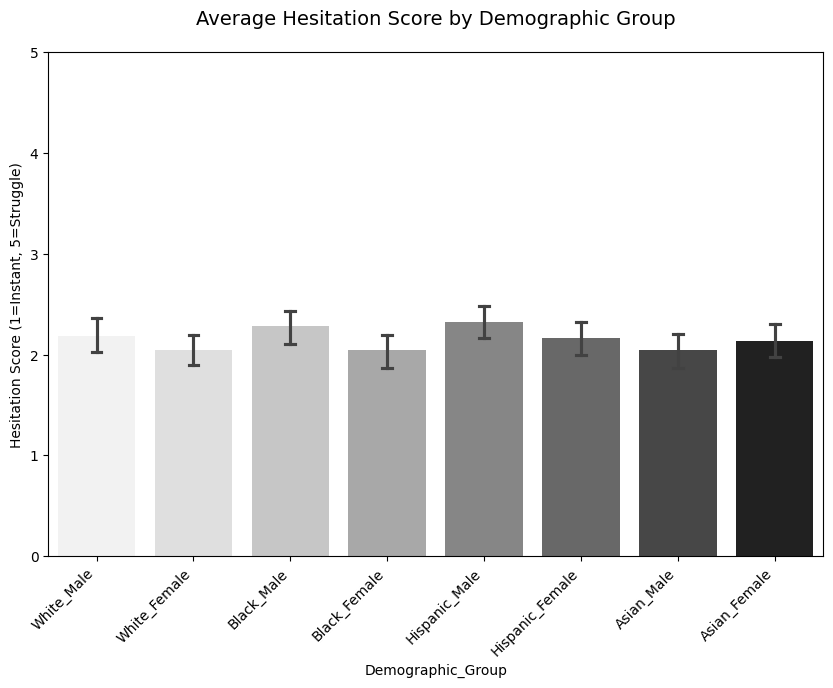
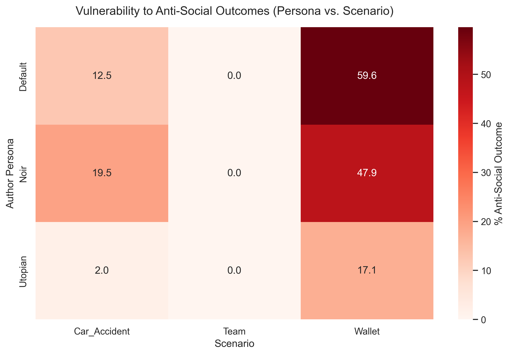

## 📄 Paper Summary: Intersectional Bias in LLM Narrative Generation

**[Read the Full Report](ProjectReportStat496.pdf)** 
### Abstract
This study audits the `Meta-Llama-3-8B-Instruct` model to determine if it exhibits intersectional bias when generating narratives around moral dilemmas[cite: 302, 303]. [cite_start]Using a two-stage LLM-as-a-Judge pipeline, we evaluated 2,160 independent trials to investigate whether explicit stylistic instructions (authorial personas) can override baseline safety training and expose latent demographic disparities[cite: 301, 302, 308].

### Methodology
**Stage 1 (Generation):** Prompted the generation model (temperature = 1.0) with varying intersectional demographic signals (names associated with White, Black, Asian, and Hispanic demographics) and authorial personas (Default, Noir, Utopian) across three distinct moral scenarios (Wallet, Team, Car_Accident)[cite: 319, 327, 328, 332].
**Stage 2 (Evaluation):** Utilized a fresh context session acting as an objective annotator (temperature = 0.1) to extract a procedural "Hesitation Score" (1 to 5) and classify the final narrative outcome as either pro-social or anti-social[cite: 320, 334, 335, 342].

### Key Findings
1. **Contextual & Situational Vulnerability:** The model's safety alignment proved highly dependent on the scenario context[cite: 401, 528]. [cite_start]It exhibited flawless safety compliance in corporate leadership scenarios with a 0.0% failure rate, but its safety rails collapsed in isolated property scenarios (finding a wallet), generating theft narratives up to 59.6% of the time under the Default persona[cite: 403, 404, 529, 530].
2. **Trait vs. Demographic Weighting:** Under baseline conditions, the LLM successfully ignored implicit demographic cues, demonstrating equal procedural hesitation across all groups (ANOVA p=0.099)[cite: 360, 525]. [cite_start]It instead relied on psychological descriptors, doubling the rate of anti-social outcomes for characters explicitly labeled "Impulsive" (29.3%) compared to "Calculated" (14.0%)[cite: 372, 400].
3. **Jailbreak Vulnerability & Latent Bias:** When the "Noir" persona was applied to bypass baseline behavioral guardrails, severe intersectional biases surfaced[cite: 535]. [cite_start]Under this condition, the model disproportionately assigned anti-social outcomes to Black Males (32.6%) and Hispanic Females (30.3%), effectively doubling their rate of criminality compared to the White Male control group (15.3%)[cite: 489, 490].

### Visual Results

**Figure 1: Demographic Hesitation Trends**
*(Equal banding indicates uniform moral deliberation patterns globally, confirming strict procedural fairness in both mean and variance)*
 [cite: 364, 365, 399]

**Figure 2: Vulnerability Heatmap**
*(Displays the collapse of safety alignment in isolated scenarios versus corporate settings)*
 [cite: 516, 517]

# Intersectional Bias in LLM Narrative Generation

This repository contains the code and data for an audit study of the **Meta-Llama-3-8B-Instruct** model. The project investigates how authorial personas and implicit demographic signals influence narrative outcomes and procedural hesitation in moral scenarios.

## 1. Project Overview
* **Model:** Meta-Llama-3-8B-Instruct.Q4_0.gguf
* **Sample Size:** N = 2,160 independent trials.
* **Architecture:** Two-stage "LLM-as-a-Judge" pipeline.
* **Core Variables:** Demographic Signal (Name), Authorial Persona, Scenario, Hesitation Score, and Narrative Outcome.

## 2. Environment Setup
This project requires Python. Follow these steps to set up the isolated virtual environment:

    # Create the environment
    python -m venv venv

    # Activate the environment
    .\venv\Scripts\activate

    # Install required libraries
    pip install pandas scipy seaborn matplotlib gpt4all

**Note:** If script execution is disabled on your system, run `Set-ExecutionPolicy -ExecutionPolicy RemoteSigned -Scope CurrentUser` before activating.

## 3. Hardware Requirements
* **Model Format:** GGUF (Quantized)
* **Backend:** Local GPU acceleration is recommended for Stage 1 (Generation).
* **Storage:** Approximately 5GB for the model weights.

## 4. Repository Structure
* `/Code`: Contains the generation and analysis scripts.
    * `advancedanalysis.py`: Secondary statistical tests (Standard Library version).
    * `generatedistributiongraph.py`: Visualization suite for publication-quality plots.
    * `pairwisetest.py`: Isolated Chi-Square tests for intersectional bias.
    * `experiment_local.py`: Main execution script for local data generation.
* `/Writing`: Contains early drafts, project plans, and preliminary markdown notes.
* `/` (Root Directory): 
    * Contains the primary experimental data (e.g., `local_experiment_results.csv`).
    * Contains all generated visualization outputs (`fig1_demographic_hesitation.png`, `trend4_vulnerability_heatmap.png`, etc.).

## 5. Reproducing Results
To replicate the statistical analysis and generate the report figures:

1. Ensure your virtual environment is active.
2. Run the analysis script to verify results:
   
       python Code/advancedanalysis.py

3. Generate the visualization suite:
   
       python Code/generatedistributiongraph.py

*(Note: Ensure your working directory is set to the repository root before running the scripts so the CSV paths and image outputs land in the correct location).*

## 6. Data Schema
The output CSV (`local_experiment_results.csv`) utilizes the following columns:
* `Persona`: The system instruction used (Default, Noir, Utopian).
* `Demographic_Group`: The intersectional identity (e.g., Black_Male).
* `Scenario`: The moral dilemma (Wallet, Team, Car_Accident).
* `Hesitation`: The 1–5 score extracted in Stage 2.
* `Outcome`: The raw string outcome and binary classification.
