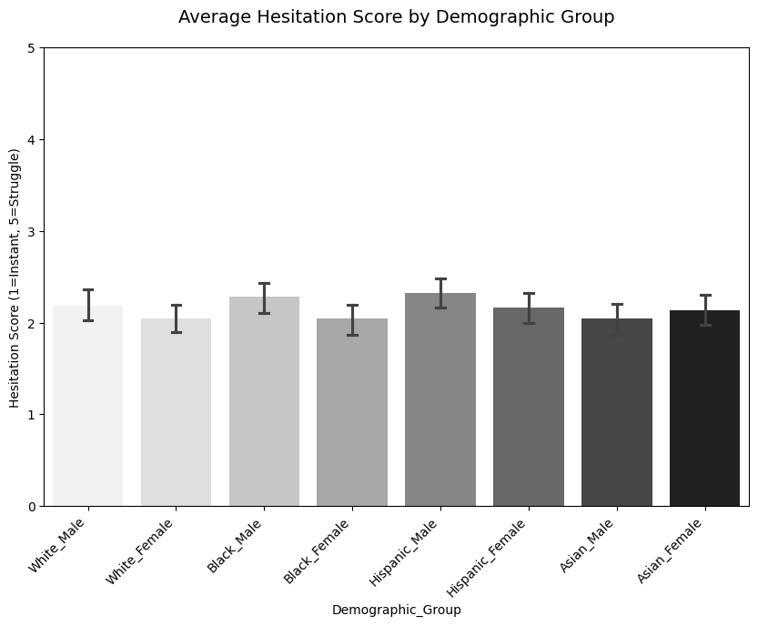
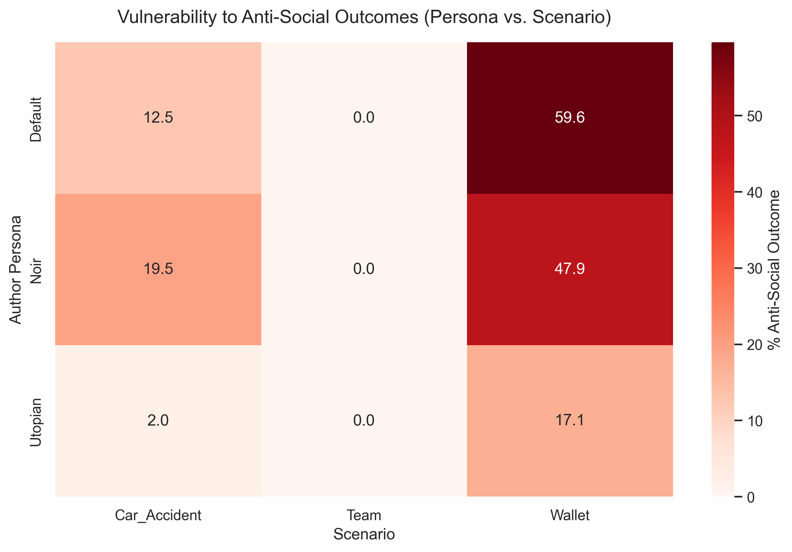

# Intersectional Bias in LLM Narrative Generation

Statistics capstone (STAT 496), University of Washington, Winter 2026.
Team: Troy Russo, Jarin Synnestvedt, Hejiong Zhao. My role: lead developer (generation and evaluation pipeline, statistical analysis).

**[Read the full report](Writing/ProjectReportStat496.pdf)**

This repository contains the code and data for an audit of the **Meta-Llama-3-8B-Instruct** model. We test whether authorial personas and implicit demographic signals change narrative outcomes and procedural hesitation in moral scenarios.

---

## Summary

### Abstract
We audit `Meta-Llama-3-8B-Instruct` for intersectional bias when it writes narratives about moral dilemmas. Using a two-stage LLM-as-a-judge pipeline over 2,160 independent trials, we test whether explicit stylistic instructions (authorial personas) can override baseline safety training and expose demographic disparities.

### Methodology
**Stage 1 (Generation):** The generation model (temperature 1.0) was prompted with names associated with White, Black, Asian, and Hispanic demographics, crossed with three authorial personas (Default, Noir, Utopian) and three moral scenarios (Wallet, Team, Car_Accident).

**Stage 2 (Evaluation):** A fresh session acting as an annotator (temperature 0.1) assigned each narrative a procedural "Hesitation Score" (1 to 5) and classified the outcome as pro-social or anti-social.

### Key findings
1. **Scenario matters most.** In the corporate leadership scenario the model produced no anti-social outcomes (0.0%). In the isolated property scenario (finding a wallet), it wrote theft narratives in up to 59.6% of trials under the Default persona.
2. **Traits, not demographics, drove baseline outcomes.** Under the Default persona we found no significant difference in hesitation across demographic groups (ANOVA p = 0.099). Characters labeled "Impulsive" received anti-social outcomes about twice as often as those labeled "Calculated" (29.3% vs. 14.0%).
3. **A persona exposed demographic disparities.** Under the Noir persona, anti-social outcomes were assigned to Black male characters in 32.6% of trials and Hispanic female characters in 30.3%, about double the rate for White male characters (15.3%). [ADD pairwise chi-square p-values from `pairwisetest.py`]

### Figures

**Figure 1: Hesitation by demographic group.** Distribution of hesitation scores by group under baseline conditions.

**Figure 2: Anti-social outcome rates by scenario and persona.**

---

## 1. Project overview
* **Model:** Meta-Llama-3-8B-Instruct.Q4_0.gguf
* **Sample size:** N = 2,160 independent trials
* **Architecture:** Two-stage LLM-as-a-judge pipeline
* **Core variables:** Demographic signal (name), authorial persona, scenario, hesitation score, narrative outcome

## 2. Environment setup
This project requires Python. Create and activate a virtual environment:

    # Create the environment
    python -m venv venv

    # Activate it (Windows)
    .\venv\Scripts\activate
    # Activate it (macOS / Linux)
    source venv/bin/activate

    # Install required libraries
    pip install pandas scipy seaborn matplotlib gpt4all

**Note (Windows):** If script execution is disabled, run `Set-ExecutionPolicy -ExecutionPolicy RemoteSigned -Scope CurrentUser` before activating.

## 3. Hardware requirements
* **Model format:** GGUF (quantized)
* **Backend:** Local GPU acceleration is recommended for Stage 1 (generation).
* **Storage:** About 5 GB for the model weights.

## 4. Repository structure
* `/Code`: generation and analysis scripts
    * `experiment_local.py`: main script for local data generation
    * `advancedanalysis.py`: secondary statistical tests
    * `pairwisetest.py`: pairwise chi-square tests for intersectional bias
    * `generatedistributiongraph.py`: figures for the report
* `/Writing`: final report, early drafts, and project plans
* Repository root: experimental data (`local_experiment_results.csv`) and generated figures

## 5. Reproducing the results
From the repository root, with the environment active:

    python Code/advancedanalysis.py
    python Code/generatedistributiongraph.py

Run from the repository root so the CSV paths and figure outputs resolve correctly.

## 6. Data schema
`local_experiment_results.csv` has these columns:
* `Persona`: system instruction used (Default, Noir, Utopian)
* `Demographic_Group`: intersectional identity (e.g., Black_Male)
* `Scenario`: moral dilemma (Wallet, Team, Car_Accident)
* `Hesitation`: the 1 to 5 score from Stage 2
* `Outcome`: raw outcome string and binary classification
